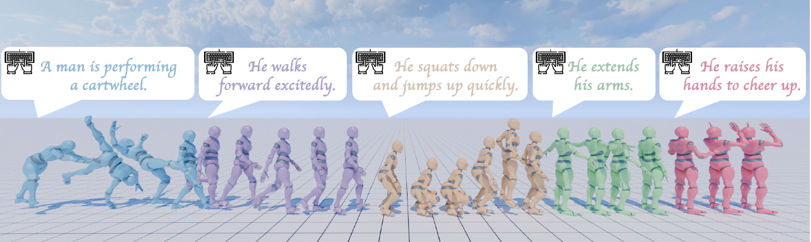

<h2 align="center"<strong>MotionStreamer: Streaming Motion Generation via Diffusion-based Autoregressive Model in Causal Latent Space</strong></h2>
  <p align="center">
    <a href='https://li-xingxiao.github.io/homepage/' target='_blank'>Lixing Xiao</a><sup>1</sup>
    ·
    <a href='https://shunlinlu.github.io/' target='_blank'>Shunlin Lu</a> <sup>2</sup>
    ·
    <a href='https://phj128.github.io/' target='_blank'>Huaijin Pi</a><sup>3</sup>
    ·
    <a href='https://vankouf.github.io/' target='_blank'>Ke Fan</a><sup>4</sup>
    ·
    <a href='https://liangpan99.github.io/' target='_blank'>Liang Pan</a><sup>3</sup>
    ·
    <a href='https://yueezhou7@gmail.com' target='_blank'>Yueer Zhou</a><sup>1</sup>
    ·
    <a href='https://dblp.org/pid/120/4362.html/' target='_blank'>Ziyong Feng</a><sup>5</sup>
    ·
    <br>
    <a href='https://www.xzhou.me/' target='_blank'>Xiaowei Zhou</a><sup>1</sup>
    ·
    <a href='https://pengsida.net/' target='_blank'>Sida Peng</a><sup>1†</sup>
    ·
     <a href='https://wangjingbo1219.github.io/' target='_blank'>Jingbo Wang</a><sup>6</sup>
    <br>
    <br>
    <sup>1</sup>Zhejiang University  <sup>2</sup>The Chinese University of Hong Kong, Shenzhen  <sup>3</sup>The University of Hong Kong  <br><sup>4</sup>Shanghai Jiao Tong University  <sup>5</sup>DeepGlint  <sup>6</sup>Shanghai AI Lab
    <br>
    <strong>ICCV 2025</strong>
    
  </p>
</p>
<p align="center">
  <a href='https://arxiv.org/abs/2503.15451'>
    </a>
  <a href='https://openaccess.thecvf.com/content/ICCV2025/papers/Xiao_MotionStreamer_Streaming_Motion_Generation_via_Diffusion-based_Autoregressive_Model_in_Causal_ICCV_2025_paper.pdf'>
    </a>
  <a href='https://zju3dv.github.io/MotionStreamer/'>
    </a>
  <a href='https://huggingface.co/datasets/lxxiao/272-dim-HumanML3D'>
    </a>
</p>



## 🔥 News

- **[2025-06]** MotionStreamer has been accepted to ICCV 2025! 🎉
  
## TODO List

- [x] Release the processing script of 272-dim motion representation.
- [x] Release the processed 272-dim Motion Representation of [HumanML3D](https://github.com/EricGuo5513/HumanML3D) dataset. Only for academic usage.
- [x] Release the training code and checkpoint of our [TMR](https://github.com/Mathux/TMR)-based motion evaluator trained on the processed 272-dim [HumanML3D](https://github.com/EricGuo5513/HumanML3D) dataset.
- [x] Release the training and evaluation code as well as checkpoint of Causal TAE.
- [x] Release the training code of original motion generation model and streaming generation model (MotionStreamer).
- [x] Release the checkpoint and demo inference code of original motion generation model.
- [ ] Release complete code for MotionStreamer.

## 🏃 Motion Representation
For more details of how to obtain the 272-dim motion representation, as well as other useful tools (e.g., Visualization and Conversion to BVH format), please refer to our [GitHub repo](https://github.com/Li-xingXiao/272-dim-Motion-Representation).

## Installation

### 🐍 Python Virtual Environment
```sh
conda env create -f environment.yaml
conda activate mgpt
```

### 🤗 Hugging Face Mirror
Since all of our models and data are available on Hugging Face, if Hugging Face is not directly accessible, you can use the HF-mirror tools following:
```sh
pip install -U huggingface_hub
export HF_ENDPOINT=https://hf-mirror.com
```

## 📥 Data Preparation
To facilitate researchers, we provide the processed 272-dim Motion Representation of:
> HumanML3D dataset at [this link](https://huggingface.co/datasets/lxxiao/272-dim-HumanML3D).

> BABEL dataset at [this link](https://huggingface.co/datasets/lxxiao/272-dim-BABEL).

❗️❗️❗️ The processed data is solely for academic purposes. Make sure you read through the [AMASS License](https://amass.is.tue.mpg.de/license.html).

1. Download the processed 272-dim [HumanML3D](https://github.com/EricGuo5513/HumanML3D) dataset following:
```bash
huggingface-cli download --repo-type dataset --resume-download lxxiao/272-dim-HumanML3D --local-dir ./humanml3d_272
cd ./humanml3d_272
unzip texts.zip
unzip motion_data.zip
```
The dataset is organized as:
```
./humanml3d_272
  ├── mean_std
      ├── Mean.npy
      ├── Std.npy
  ├── split
      ├── train.txt
      ├── val.txt
      ├── test.txt
  ├── texts
      ├── 000000.txt
      ...
  ├── motion_data
      ├── 000000.npy
      ...
```

2. Download the processed 272-dim [BABEL](https://babel.is.tue.mpg.de/) dataset following:
```bash
huggingface-cli download --repo-type dataset --resume-download lxxiao/272-dim-BABEL --local-dir ./babel_272
cd ./babel_272
unzip texts.zip
unzip motion_data.zip
```
The dataset is organized as:
```
./babel_272
  ├── t2m_babel_mean_std
      ├── Mean.npy
      ├── Std.npy
  ├── split
      ├── train.txt
      ├── val.txt
  ├── texts
      ├── 000000.txt
      ...
  ├── motion_data
      ├── 000000.npy
      ...
```

3. Download the processed streaming 272-dim [BABEL](https://babel.is.tue.mpg.de/) dataset following:
```bash
huggingface-cli download --repo-type dataset --resume-download lxxiao/272-dim-BABEL-stream --local-dir ./babel_272_stream
cd ./babel_272_stream
unzip train_stream.zip
unzip train_stream_text.zip
unzip val_stream.zip
unzip val_stream_text.zip
```
The dataset is organized as:
```
./babel_272_stream
  ├── train_stream
      ├── seq1.npy
      ...
  ├── train_stream_text
      ├── seq1.txt
      ...
  ├── val_stream
      ├── seq1.npy
      ...
  ├── val_stream_text
      ├── seq1.txt
      ...
```
> NOTE: We process the original BABEL dataset to support training of streaming motion generation. e.g. If there is a motion sequence A, annotated as (A1, A2, A3, A4) in BABEL dataset, each subsequence has text description: (A1_t, A2_t, A3_t, A4_t).

> Then, our BABEL-stream is constructed as:

> seq1: (A1, A2) --- seq1_text: (A1_t*A2_t#A1_length)

> seq2: (A2, A3) --- seq2_text: (A2_t*A3_t#A2_length)

> seq3: (A3, A4) --- seq3_text: (A3_t*A4_t#A3_length)

> Here, * and # is separation symbol, A1_length means the number of frames of subsequence A1.

## 🚀 Training
1. Train our [TMR](https://github.com/Mathux/TMR)-based motion evaluator on the processed 272-dim [HumanML3D](https://github.com/EricGuo5513/HumanML3D) dataset:
    ```bash
    bash TRAIN_evaluator_272.sh
    ```
    >After training for 100 epochs, the checkpoint will be stored at: 
    ``Evaluator_272/experiments/temos/EXP1/checkpoints/``.

    ⬇️ We provide the evaluator checkpoint on [Hugging Face](https://huggingface.co/lxxiao/MotionStreamer/tree/main/Evaluator_272), download it following:
    ```bash
    python humanml3d_272/prepare/download_evaluator_ckpt.py
    ```
    >The downloaded checkpoint will be stored at: ``Evaluator_272/``.
2. Train the Causal TAE:
    ```bash
    bash TRAIN_causal_TAE.sh ${NUM_GPUS}
    ```
    > e.g., if you have 8 GPUs, run: bash TRAIN_causal_TAE.sh 8

    > The checkpoint will be stored at:
    ``Experiments/causal_TAE_t2m_272/``

    > Tensorboard visualization:
    ```bash
    tensorboard --logdir='Experiments/causal_TAE_t2m_272'
    ```

    ⬇️ We provide the Causal TAE checkpoint on [Hugging Face](https://huggingface.co/lxxiao/MotionStreamer/tree/main/Causal_TAE), download it following:
    ```bash
    python humanml3d_272/prepare/download_Causal_TAE_t2m_272_ckpt.py
    ```

3. Train text to motion model:
    > We provide scripts to train the original text to motion generation model with llama blocks, Two-Forward strategy and QK-Norm, using the motion latents encoded by the Causal TAE (trained in the first stage).
    
    3.1 Get motion latents:
   ```bash
   python get_latent.py --resume-pth Causal_TAE/net_last.pth --latent_dir humanml3d_272/t2m_latents
   ```
    3.2 Download [sentence-T5-XXL model](https://huggingface.co/sentence-transformers/sentence-t5-xxl/tree/main) on Hugging Face:
   ```bash
   huggingface-cli download --resume-download sentence-transformers/sentence-t5-xxl --local-dir sentencet5-xxl/
   ```
    3.3 Train text to motion generation model:
   ```bash
   bash TRAIN_t2m.sh ${NUM_GPUS}
   ```
    > e.g., if you have 8 GPUs, run: bash TRAIN_t2m.sh 8

    > The checkpoint will be stored at:
    ``Experiments/t2m_model/``

    > Tensorboard visualization:
    ```bash
    tensorboard --logdir='Experiments/t2m_model'
    ```

    ⬇️ We provide the text to motion model checkpoint on [Hugging Face](https://huggingface.co/lxxiao/MotionStreamer/tree/main/Experiments/t2m_model), download it following:
    ```bash
    python humanml3d_272/prepare/download_t2m_model_ckpt.py
    ```

4. Train streaming motion generation model (MotionStreamer):
    > We provide scripts to train the streaming motion generation model (MotionStreamer) with llama blocks, Two-Forward strategy and QK-Norm, using the motion latents encoded by the Causal TAE (need to train a new Causal TAE using both HumanML3D-272 and BABEL-272 data).
    
    4.1 Train a Causal TAE using both HumanML3D-272 and BABEL-272 data:
    ```bash
    bash TRAIN_causal_TAE.sh ${NUM_GPUS} t2m_babel_272
    ```
    > e.g., if you have 8 GPUs, run: bash TRAIN_causal_TAE.sh 8 t2m_babel_272

    > The checkpoint will be stored at:
    ``Experiments/causal_TAE_t2m_babel_272/``

    > Tensorboard visualization:
    ```bash
    tensorboard --logdir='Experiments/causal_TAE_t2m_babel_272'
    ```

    ⬇️ We provide the Causal TAE checkpoint trained using both HumanML3D-272 and BABEL-272 data on [Hugging Face](https://huggingface.co/lxxiao/MotionStreamer/tree/main/Causal_TAE_t2m_babel), download it following:
    ```bash
    python humanml3d_272/prepare/download_Causal_TAE_t2m_babel_272_ckpt.py
    ```

    4.2 Get motion latents of both HumanML3D-272 and the processed BABEL-272-stream dataset:
   ```bash
   python get_latent.py --resume-pth Causal_TAE_t2m_babel/net_last.pth --latent_dir babel_272_stream/t2m_babel_latents --dataname t2m_babel_272
   ``` 

    4.3 Train MotionStreamer model:
   ```bash
   bash TRAIN_motionstreamer.sh ${NUM_GPUS}
   ```
   > e.g., if you have 8 GPUs, run: bash TRAIN_motionstreamer.sh 8

   > The checkpoint will be stored at:
    ``Experiments/motionstreamer_model/``

    > Tensorboard visualization:
    ```bash
    tensorboard --logdir='Experiments/motionstreamer_model'
    ```

## 📍 Evaluation

1. Evaluate the metrics of the processed 272-dim [HumanML3D](https://github.com/EricGuo5513/HumanML3D) dataset:
    ```bash
    bash EVAL_GT.sh
    ```
    ( FID, R@1, R@2, R@3, Diversity and MM-Dist (Matching Score) are reported. )

2. Evaluate the metrics of Causal TAE:
    ```bash
    bash EVAL_causal_TAE.sh
    ```
    ( FID and MPJPE (mm) are reported. )

3. Evaluate the metrics of text to motion model:
    ```bash
    bash EVAL_t2m.sh
    ```
    ( FID, R@1, R@2, R@3, Diversity and MM-Dist (Matching Score) are reported. )


## 🎬 Demo Inference

1. Inference of text to motion model:
    > [Option1] Recover from joint position 
    ```bash
    python demo_t2m.py --text 'a person is walking like a mummy.' --mode pos --resume-pth Causal_TAE/net_last.pth --resume-trans Experiments/t2m_model/latest.pth
    ```
    > [Option2] Recover from joint rotation 
    ```bash
    python demo_t2m.py --text 'a person is walking like a mummy.' --mode rot --resume-pth Causal_TAE/net_last.pth --resume-trans Experiments/t2m_model/latest.pth
    ```
    > In our 272-dim representation, Inverse Kinematics (IK) is not needed.
    > For further conversion to BVH format, please refer to [this repo](https://github.com/Li-xingXiao/272-dim-Motion-Representation?tab=readme-ov-file#6-representation_272-to-bvh-conversion-optional) (Step 6: Representation_272 to BVH conversion). The BVH format of motion animation can be visualizd and edited in [Blender](https://www.blender.org/features/animation/).


## 🌹 Acknowledgement
This repository builds upon the following awesome datasets and projects:
- [272-dim-Motion-Representation](https://github.com/Li-xingXiao/272-dim-Motion-Representation)
- [AMASS](https://amass.is.tue.mpg.de/index.html)
- [HumanML3D](https://github.com/EricGuo5513/HumanML3D)
- [T2M-GPT](https://github.com/Mael-zys/T2M-GPT)
- [TMR](https://github.com/Mathux/TMR)
- [OpenTMA](https://github.com/LinghaoChan/OpenTMA)
- [Sigma-VAE](https://github.com/orybkin/sigma-vae-pytorch)
- [Scamo](https://github.com/shunlinlu/ScaMo_code)

## 🤝🏼 Citation
If our project is helpful for your research, please consider citing :
``` 
@InProceedings{Xiao_2025_ICCV,
    author    = {Xiao, Lixing and Lu, Shunlin and Pi, Huaijin and Fan, Ke and Pan, Liang and Zhou, Yueer and Feng, Ziyong and Zhou, Xiaowei and Peng, Sida and Wang, Jingbo},
    title     = {MotionStreamer: Streaming Motion Generation via Diffusion-based Autoregressive Model in Causal Latent Space},
    booktitle = {Proceedings of the IEEE/CVF International Conference on Computer Vision (ICCV)},
    month     = {October},
    year      = {2025},
    pages     = {10086-10096}
}
```

## Star History

[](https://www.star-history.com/#zju3dv/MotionStreamer&Date)
