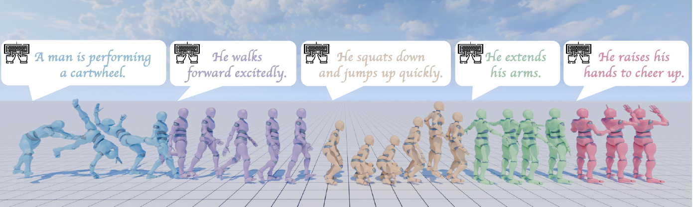

# MotionStreamer: Streaming Motion Generation via Diffusion-based Autoregressive Model in Causal Latent Space
### [Project Page](https://zju3dv.github.io/MotionStreamer/) | [Paper](https://arxiv.org/pdf/2503.15451)
<br/>

> MotionStreamer: Streaming Motion Generation via Diffusion-based Autoregressive Model in Causal Latent Space
> [Lixing Xiao](https://li-xingxiao.github.io/homepage/), [Shunlin Lu](https://shunlinlu.github.io/), [Huaijin Pi](https://phj128.github.io/), [Ke Fan](https://vankouf.github.io/), [Liang Pan](https://liangpan99.github.io/), [Yueer Zhou](https://scholar.google.com/citations?user=EWC3UGYAAAAJ/), [Ziyong Feng](https://dblp.org/pid/120/4362.html/), [Xiaowei Zhou](https://www.xzhou.me/), [Sida Peng](https://pengsida.net/)<sup>†</sup>, [Jingbo Wang](https://wangjingbo1219.github.io/)



## TODO List

- [x] Release the processing script of 272-dim motion representation.
- [ ] Release complete code for MotionStreamer.

## 🏃 Motion Representation
Please refer to [this repo](https://github.com/Li-xingXiao/272-dim-Motion-Representation) for the 272-dim motion representation.


## 🤝🏼 Citation
If our project is helpful for your research, please consider citing :
``` 
@article{xiao2025motionstreamer,
      title={MotionStreamer: Streaming Motion Generation via Diffusion-based Autoregressive Model in Causal Latent Space},
      author={Xiao, Lixing and Lu, Shunlin and Pi, Huaijin and Fan, Ke and Pan, Liang and Zhou, Yueer and Feng, Ziyong and Zhou, Xiaowei and Peng, Sida and Wang, Jingbo},
      journal={arXiv preprint arXiv:2503.15451},
      year={2025}
    }
```
